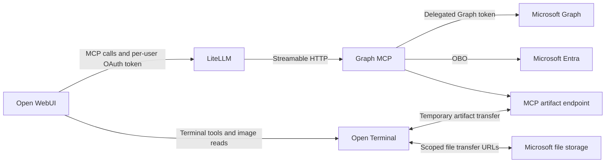
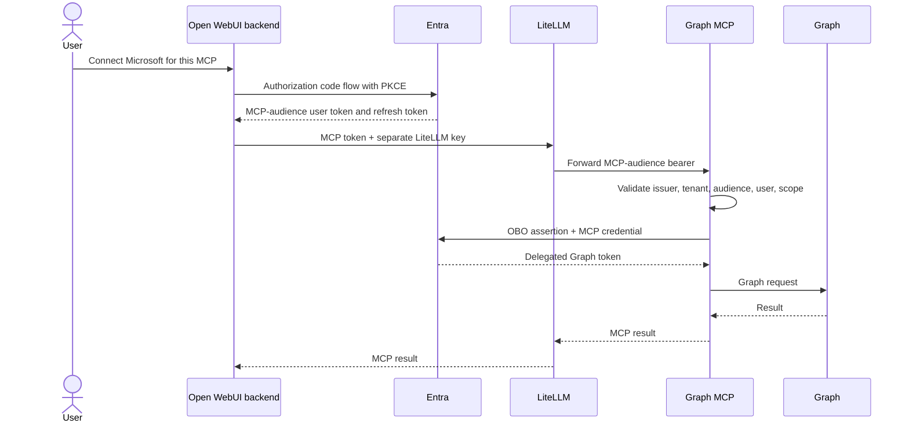

# Architecture specification

Date: 2026-09-10. Status: target design based on agreed requirements. The authentication and `/me` scaffold is implemented locally; the broader system and live deployment remain pending. See [setup and implementation boundaries](setup.md).

## 1. Objective and agreed requirements

Provide Microsoft 365 access through a thin Graph MCP, avoiding the Work IQ Files MCP's reported hard-coded 5 MB limit. The server should retain Graph's request and response semantics while giving the model useful, progressively retrievable data.

| Requirement | Decision |
| --- | --- |
| Client chain | Open WebUI 0.11.3 → LiteLLM 1.100.0 → Graph MCP |
| Transport | Streamable HTTP; a dedicated MCP route through LiteLLM |
| Identity | Delegated Entra access; an interactive Microsoft connection for the MCP is acceptable |
| Existing login | Open WebUI uses Entra SSO with its own registration; keep this independent |
| Distribution | Community deployments; no design dependency on enterprise-only gateway features |
| Users | Internal deployment, initially personal use, with user isolation from the start; Copilot licensing can differ by user |
| Coverage | Outlook including shared access, Teams and meetings, OneDrive, SharePoint, basic Planner, To Do, Excel, Word, PowerPoint, profile/people/contacts |
| Writes | Create, update, delete, send, and supported actions under the user's permissions |
| Files | Support files through 250 MB where the destination service permits; transfer bytes outside model context |
| Clusters | AKS/RKE2; no shared MCP/terminal filesystem; terminal can access Microsoft endpoints |
| Documents | Preserve existing style unless instructed otherwise; save a copy by default |
| Templates | SharePoint, OneDrive, chat uploads, and terminal-local references |
| Visual feedback | Model receives rendered pages/slides and can correct layout iteratively |
| Context | Compact defaults, explicit expansion, full-result retrieval; no universal 4,000-token cutoff |
| Temporary content | Allowed, isolated, short-lived, automatically cleaned up |
| Availability | At least two replicas by default; replica count supplied at deployment; node spread and disruption handling |
| Enterprise trust | Additional PEM CA roots on Graph, OBO and JWKS connections; public roots and TLS verification retained |
| Build/distribution | Manual source builds on work machines or Mac; Harbor/GHCR; CI optional |

“Whatever the user can do” means the Graph-exposed subset of the user's authorized operations. API gaps, resource permissions, tenant policies, and service limits remain visible. The server must not imply full Microsoft application UI parity.

## 2. Component boundaries



Open WebUI coordinates tool calls and model input. LiteLLM routes MCP calls and provides gateway admission. The MCP performs Graph requests, token exchange, response selection, and transfer preparation. The terminal owns document parsing, creation, editing, rendering, and local analysis.

The MCP does not call terminal tools merely because both toolsets are in a chat. The model coordinates them using explicit transfer descriptors and file references. A path in the terminal is never assumed to exist on the MCP server.

No server-side LLM, document editor, browser engine, vector database, background mailbox crawler, or automatic semantic summarizer is required in the MCP. Search uses Microsoft APIs. Extraction and analysis run in the terminal.

## 3. Authentication decision

### 3.1 Default: separate MCP authorization, one OBO exchange

Use Open WebUI's static OAuth connection to obtain an Entra token issued for the Graph MCP. Route it through LiteLLM using `oauth_delegate`. The MCP validates the token and exchanges it for delegated Graph access.

LiteLLM documents separate headers for gateway admission and the upstream token. Its 1.100.0 source includes `oauth_delegate`; Open WebUI 0.11.3 includes static OAuth and custom connection headers. This establishes available building blocks, not a tested complete flow. [LiteLLM routing documentation](https://docs.litellm.ai/docs/mcp_oauth_passthrough), [LiteLLM auth types](https://github.com/BerriAI/litellm/blob/v1.100.0/litellm/types/mcp.py), [Open WebUI headers](https://github.com/open-webui/open-webui/blob/v0.11.3/backend/open_webui/utils/tools.py#L127)



This proposal uses two new logical app roles, normally implemented as two registrations, in addition to the existing WebUI SSO registration:

| Registration | Role | Credentials and permissions |
| --- | --- | --- |
| Existing WebUI SSO | Sign into WebUI | Existing configuration remains separate |
| WebUI Microsoft-tools OAuth client | Interactive confidential client | Secret held by WebUI backend; redirect URI from its actual MCP OAuth callback; permission to the MCP API scope |
| Graph MCP API | Protected resource and OBO confidential client | Exposes a delegated scope such as `access_as_user`; Graph delegated permissions; credential held only by MCP |

Use a tenant-specific authority for the initial internal, single-tenant deployment. Multi-user within that tenant is required; multi-tenant SaaS is not.

The WebUI OAuth client requests the exposed MCP scope plus the identity/refresh scopes needed by its OAuth implementation. The MCP requests `https://graph.microsoft.com/.default` during OBO, representing its consented delegated Graph scopes. Configure downstream consent before relying on noninteractive exchange. Microsoft requires the assertion audience to identify the app performing OBO. [Microsoft OBO protocol and consent](https://learn.microsoft.com/en-us/entra/identity-platform/v2-oauth2-on-behalf-of-flow)

### 3.2 Credential placement

| Hop/component | Credential |
| --- | --- |
| WebUI → LiteLLM | `Authorization: Bearer <MCP-user-token>` |
| WebUI → LiteLLM | Separate custom `x-litellm-api-key: Bearer <gateway-key>` |
| LiteLLM → MCP | MCP-user-token only; gateway admission key is not forwarded |
| MCP → Entra | MCP client credential and incoming user assertion |
| MCP → Graph | Graph-user-token |
| Terminal transfer | File-scoped Microsoft URL or temporary artifact ticket, never an Entra secret or broad Graph token |

Illustrative LiteLLM settings, not a deployable configuration:

```yaml
mcp_servers:
  msgraph:
    url: "https://<internal-graph-mcp>/mcp"
    transport: "http"
    auth_type: oauth_delegate
```

Use the single-server client route `https://<litellm-host>/msgraph/mcp`. No Entra client ID/secret is required in this LiteLLM MCP entry. The WebUI OAuth client's credentials and MCP OBO credentials have different roles and are not copies of one secret.

A connection-wide gateway key admits the WebUI integration, not necessarily the individual Microsoft user. Attribute Graph operations using the validated tenant/user identity at the MCP. Per-user LiteLLM keys can be added if the existing deployment already provides them; Entra user isolation must not depend on that feature.

### 3.3 Discovery, validation, and refresh

- Publish OAuth protected-resource metadata and the tenant authorization-server reference. The public resource identity must remain stable through the proxy.
- Document the mapping between the public MCP resource URL, Entra App ID URI, and expected token `aud`. Do not derive accepted audiences from arbitrary request headers.
- Verify Entra compatibility with Open WebUI's OAuth resource-indicator handling and explicit scopes. If Entra requires WebUI's “Omit resource” setting, document and test that interoperability choice. Do not assume that an RFC 8707 URL directly becomes an Entra audience.
- Check signature, issuer, expiry, tenant, configured audience, delegated scope, and authorized client as applicable. Reject app-only and wrong-audience tokens.
- Never accept a Graph-audience token as MCP authentication. Proxying an MCP-audience token through LiteLLM is distinct from passing a Graph token through an MCP. [MCP authorization](https://modelcontextprotocol.io/specification/2025-11-25/basic/authorization)
- WebUI stores and refreshes its per-user OAuth connection. MCP caches Graph tokens through MSAL, segregated by tenant, user/assertion, client, and resource/scopes. Cache an assertion hash, not the raw assertion as a loggable key.
- Return actionable reauthorization/claims challenges. Verify propagation through LiteLLM and WebUI; do not loop silently on failed OBO or fall back to application permissions.
- An optional Copilot scope or unavailable feature must not make core tools unusable. Start with core consent; add optional consent separately if tenant policy requires it. If an optional consent causes acquisition failure, treat it as a configuration issue and repair the scope bundle rather than denying unrelated services.

The initial compatibility gate includes discovery without a user token, first login, tool listing, first call, refresh, disconnect/reconnect, and user isolation. Do not interpret a successful metadata check as successful authorization.

### 3.4 Alternative if gateway-owned OBO becomes necessary

LiteLLM 1.100.0 also contains `token_exchange_profile: entra_obo`. A token issued for a LiteLLM API registration can be exchanged for an MCP token, followed by MCP-to-Graph OBO. This is a documented fallback design, not the default; it adds an API registration role and another exchange without a current requirement for them. [LiteLLM OBO](https://docs.litellm.ai/docs/mcp_obo_auth)

## 4. MCP interface

### 4.1 Small tool surface, inspectable Graph operations

Proposed tool contracts below are design names, not implemented APIs. Keep initial tool descriptions short; load endpoint detail on demand.

| Tool | Purpose and principal inputs |
| --- | --- |
| `graph_capabilities` | Report supported service groups and per-user observed availability; optionally probe a requested feature |
| `graph_describe` | Search operation catalog by service/query, or describe a method/path with parameters, required scopes, examples, and limits |
| `graph_read` | Execute an explicitly read-only method/path/query/body with output preferences |
| `graph_write` | Execute a mutation with method/path/query/body, selected headers, and operation identifier for reconciliation |
| `graph_continue` | Follow a server-issued pagination/result/job handle; never repeat the original mutation |
| `graph_prepare_transfer` | Prepare download/upload for a Graph file, attachment, transcript, or stored result |
| `graph_transfer_status` | Read transfer state and verify an uploaded destination |
| `graph_transfer_manage` | Explicitly cancel/release a transfer or extend permitted artifact retention |

Use Graph-relative paths and Graph-native JSON bodies. A small catalog adds discoverability and known read/write semantics without generating a separate MCP tool for every endpoint. `graph_describe` can be backed by curated endpoint metadata, expanded from Microsoft metadata during development; it must not dump the complete Graph schema into model context.

The read/write split gives clients meaningful tool annotations. HTTP method alone is insufficient: `/search/query` is a read using POST, while some actions are writes. Unknown operations go through `graph_write` conservatively. Runtime side effects are determined by the concrete operation, not by a model-supplied “read-only” flag. Transfer preparation/management are conservatively annotated as potentially mutating because they can create sessions or cancel work. No bespoke approval UI or mandatory extra confirmation is added by the MCP.

Allow Graph v1.0 by default. Beta paths must be an explicit configuration/call choice with their status visible. Keep breadth within the agreed Microsoft 365 families; this is not an Entra tenant administration gateway. Path validation, including batch subrequests, must prevent escaping the configured Graph origin or supplying arbitrary authentication headers.

Preserve supported query options and headers such as `$select`, `$filter`, `$search`, `$orderby`, `$expand`, `Prefer`, `ConsistencyLevel`, `If-Match`, and `workbook-session-id`. Do not inject unsupported query options into arbitrary endpoints. Catalog defaults apply only where tested.

JSON batch is optional convenience in the generic request path, with validation of every subrequest and per-item status. Graph's current maximum is 20 subrequests; batching does not make writes atomic. [Graph batching](https://learn.microsoft.com/en-us/graph/json-batching)

### 4.2 Response contract

Return a compact envelope containing Graph data and explicit retrieval state. An illustrative response:

```json
{
  "status": 200,
  "data": [{"id": "item-id", "name": "Quarterly update.pptx"}],
  "delivery": "inline",
  "selection": {"fields": ["id", "name"], "source": "caller"},
  "page": {"returned": 1, "has_more": true, "continuation": "opaque-handle"},
  "content": {"complete": true, "omitted_fields": []},
  "request_id": "graph-request-id"
}
```

`content.complete` concerns the represented page/item, not the entire collection. `page.has_more` conveys upstream pagination. If a page itself exceeds the inline preference, cache the full fetched page and issue a local continuation before the upstream next page. Never skip unfed items by returning only Graph's next link.

Preserve IDs, eTags, source web links, and useful error details. Binary/transfer secrets are not included in generic listings. Store preauthenticated URLs only in transfer descriptors, rather than exposing `@microsoft.graph.downloadUrl` automatically on every file result.

Use MCP `structuredContent` and a concise text representation where supported. Verify the actual LiteLLM/WebUI path; avoid duplicating the entire payload into two model-visible representations. Validation errors and execution failures must remain distinguishable from successful empty data.

## 5. Context management

Use progressive retrieval, not a universal token cutoff. The model can request `output.mode = auto | inline | artifact`, specific fields, page size, and optional text/line selection. Default `auto` returns a useful preview or selected page and makes the full fetched result retrievable.

| Data shape | Default |
| --- | --- |
| Collections/search | Metadata and short previews; one page, no automatic full traversal |
| Individual message/event/task | Relevant requested fields; body available explicitly |
| Long text/transcript | Metadata and requested excerpt, plus full-content artifact access |
| Large JSON | Small shape/row preview plus complete stored response |
| File | Metadata and transfer preparation; no base64 document body |
| Office document | Terminal outline and selected renders, through terminal tools |

Maintain operator-configurable soft inline preferences by endpoint/content type. Crossing a preference changes delivery, not accessibility. A full result remains available as an artifact or continuation. Explicit `inline` can exceed the normal preference within actual infrastructure/provider constraints. If it cannot be delivered, explain why and return a retrievable result, never malformed or silently truncated content.

Do not call approximate characters “exact model tokens.” The MCP can report bytes and an optional labeled estimate, but it normally does not know the conversation's remaining context. Open WebUI/model instructions own cumulative retrieval discipline and compaction. Old tool messages cannot be removed by this server.

Distinguish retrieval scopes: a stored “complete response” means the exact fetched response, not every item in a remote collection. Fetching all pages is explicit export work with cancellation, progress, and completion status. Store large responses with streaming/spooled I/O rather than reading the whole body into RAM before deciding to externalize it.

No semantic summaries are generated in the MCP. Optional HTML-to-text views must disclose the conversion, retain raw content, and preserve useful links. Service-generated Copilot insights are labeled as such and kept distinct from model-generated summaries.

## 6. File transfer and temporary artifacts

### 6.1 Native Microsoft transfers

For OneDrive/SharePoint files, prefer Microsoft-generated download URLs and upload sessions. The terminal needs no general Graph token to use a preauthenticated download URL. Request URLs immediately before transfer because their validity is short. [Drive downloads](https://learn.microsoft.com/en-us/graph/api/driveitem-get-content?view=graph-rest-1.0)

Target **250,000,000 bytes** as the initial interpretation of 250 MB, configurable upward later. This is a supported transfer target, not an MCP JSON body allowance. Drive single-request uploads support 250 MB; use resumable sessions in the terminal for practical reliability, including smaller files. [Drive upload](https://learn.microsoft.com/en-us/graph/api/driveitem-put-content?view=graph-rest-1.0)

An upload descriptor includes destination drive/parent/item IDs, file name, expected size, expiry, upload URL, method, chunk rules, conflict behavior, and a transfer handle. A download descriptor includes source IDs/eTag, file size/type/name, URL, expiry if known, and a handle. Do not invent expiry timestamps for URLs where Microsoft gives none; mark them short-lived and refresh on rejection.

Terminal upload code must follow endpoint-specific sequential range rules, resume using the service's accepted ranges, and avoid attaching the Graph bearer to preauthenticated storage URLs. For drive sessions use a configurable default chunk of 10 MiB (a multiple of 320 KiB and under the documented 60 MiB per-request limit), with a smaller final fragment permitted. Outlook attachment sessions require their own chunk rules. [Drive upload sessions](https://learn.microsoft.com/en-us/graph/api/driveitem-createuploadsession?view=graph-rest-1.0)

Native transfer URLs are bearer capabilities visible to tool coordination. Keep them out of ordinary status logs and final user responses; they may still appear in chat/tool history. Anyone holding one can exercise its scope until it expires. Prefer provider-enforced expiry and tightly scoped destinations; do not claim they are single-use or immediately revocable. Where such exposure is unsuitable, the same contract can use MCP-scoped transfer tickets.

### 6.2 Artifacts and resources without native transfer URLs

Transcripts, oversized JSON, and attachment downloads do not all offer drive-style preauthenticated links. Provide a small streaming artifact endpoint alongside the MCP, reachable by the terminal through a private ingress. It is a byte-transfer route, not a second interactive Graph gateway.

The MCP fetches content under the authenticated user's delegated context and stages it in an artifact store. The model receives a bounded preview plus a download ticket scoped to that artifact and method. The terminal streams the artifact using the ticket. Tickets contain no Graph token and cannot select arbitrary upstream URLs. The endpoint must not forward Entra bearer tokens across redirects.

Store artifact metadata with owner tenant/user, MIME type, byte length, hash, source/retrieval time, expiry, and completion state. Authenticate ticket issuance using the MCP user token. A ticket is a delegated capability, so isolation tests must cover guessing, substitution, expiry, and sharing; ownership checks alone do not protect a deliberately leaked ticket.

Suggested tunable defaults: artifact TTL 60 minutes, transfer-ticket TTL 10 minutes capped by artifact expiry, cleanup every 5 minutes, immediate logical invalidation on release. These are retention defaults, not model-content limits. Allow extending active work explicitly within deployment storage policy. Never expire an actively leased stream mid-transfer; expired tickets cannot start new streams. Explicit release invalidates tickets immediately, with physical deletion after streams close.

Use an S3-compatible object store (including MinIO) or Azure Blob adapter for replicated deployments, plus a small shared metadata store. Provider lifecycle expiration backs up application cleanup. Signed tickets must be checked on every new request; deletion lag must not extend access. Artifact retention and browser/chat log retention are separate.

MCP cleanup cannot delete terminal files or revoke a copy already downloaded. Terminal scratch previews have their own cleanup policy. Source files and final user outputs are never treated as MCP staging content.

### 6.3 Saving and verification

Default document edits create a new file. The transfer helper exposes `save_mode: copy | overwrite`, defaulting to `copy`. Resolve name conflicts as a new unique name, not overwrite. An explicit overwrite binds the upload to the original item ID and observed eTag using supported conditional operations. If the source changed, report a conflict; do not silently overwrite it.

The copy default applies to document orchestration and transfer helpers. Generic `graph_write` preserves the caller's explicit Graph method and destination; it does not silently redirect a PATCH to a new resource. Model/terminal instructions must select a copy before editing a live workbook or issuing a direct file replacement unless the user requested an in-place change.

After transfer, verify Graph item ID, size, returned version/eTag, and destination. Use checksums where available and compatible; do not equate an eTag with a content hash or compare unlike hash algorithms. A timeout after final upload is an uncertain outcome requiring reconciliation, not immediate duplicate creation.

Outlook attachment limits remain separate: upload sessions support 3–150 MB, subject to mailbox/message limits and shared-mailbox issues. A 250 MB drive transfer requirement does not imply 250 MB email attachments. For an oversized attachment, offer a file link rather than silently changing the requested message. [Outlook large attachments](https://learn.microsoft.com/en-us/graph/outlook-large-attachments)

## 7. Reliability and deployment

Proposed implementation stack: Python 3.12, an official MCP Python SDK Streamable HTTP server in an ASGI application, an async HTTP client for Graph, and MSAL for token acquisition/cache. Pin actual package versions after the compatibility gates; this document does not invent dependency versions. Keep full Graph SDK code generation optional because the interface deliberately preserves raw Graph paths/bodies.

Use stateless MCP request handling. The implemented authentication/profile slice uses independent, bounded per-replica OBO caches; a cache miss reacquires the token, so this slice needs no shared token store or sticky sessions. Future continuations, jobs, and artifact metadata require shared durable state or self-contained authenticated handles. A development-only pod-local artifact store must report restart loss explicitly; sticky routing alone is not a durability strategy. The [deployment guide](kubernetes.md) describes the implemented two-replica default, scheduling, disruption controls, and enterprise CA support.

Expose `/mcp`, protected-resource metadata, artifact transfer routes, and minimal health/readiness endpoints. Configure the ingress for negotiated JSON/event-stream responses, required MCP headers, suitable idle timeouts, and no inappropriate buffering. Long exports should return a job handle rather than hold a tool call indefinitely. Cancellation stops further reads/uploads where possible and reports already-completed side effects.

Operational ceilings for memory, storage, concurrency, and time remain necessary. They must not become unexplained file/context truncation. Validate TLS, Origin where applicable, and forwarded-host behavior for the actual ingress. Network policy keeps MCP access through LiteLLM and allows only the terminal artifact route separately; the terminal also needs Microsoft storage egress, not just `graph.microsoft.com`.

Honor Graph `Retry-After` for throttling, with bounded retries and useful status when the delay exceeds the tool-call budget. Retry safe reads appropriately. For writes, distinguish explicit rejected requests from connection loss after possible execution. Do not blindly retry sends, event creation, or other non-idempotent mutations. Batch failures are reconciled per subrequest. [Graph throttling](https://learn.microsoft.com/en-us/graph/throttling)

Use conditional edits and endpoint-specific transaction identifiers where supported. A local operation identifier assists reconciliation but is not a promise of globally exactly-once execution.

Log correlation ID, user/tenant, operation, duration, status, response size, transfer state, and retry count. Redact authorization, client secrets, transfer URLs/tickets, and document/mail bodies. Log permission/license errors without labeling every 403 as a licensing problem. No directory-wide license scan is needed merely to decide whether to attempt a user's optional feature.

## 8. Remaining deployment inputs and next phase

The architecture does not require more product-scope decisions. Implementation will need the actual tenant and registration IDs, public/internal hostnames, WebUI callback URI, credential provision mechanism, artifact-store choice, and representative document/meeting fixtures. Record these as deployment inputs; do not place secrets in this repository.

Before expanding service coverage, validate three end-to-end slices: delegated `/me`, a large file round trip, and an image read that the selected model demonstrably sees. Complete the broader [acceptance matrix](acceptance.md) before claiming full coverage.

Any failure of the proposed OAuth proxy flow is an integration finding to resolve, not permission to silently weaken authentication or switch to app-only access. Any document fidelity gap is recorded against its feature and fixture. No implementation or external configuration changes are authorized by the existence of this specification alone.
