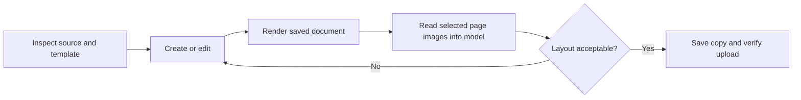

# Terminal and document contract

Status: proposed companion contract for the custom terminal image. This document specifies helpers and behavior; no helper, image, or package installation has been implemented.

## 1. Runtime baseline

The user supplied this inventory:

| Component | Version/capability |
| --- | --- |
| Shells | bash, sh |
| Python | 3.12 |
| JavaScript | node, npm; versions to pin during image build |
| Open Terminal | 0.11.34 |
| PowerPoint | python-pptx 1.0.2 |
| Excel | openpyxl 3.1.5, xlsxwriter 3.2.9 |
| Data/plots | pandas 3.0.5, matplotlib 3.11.1 |
| PDF | pypdf 6.17.0, pypdfium2 5.13.0 |
| Office renderer | LibreOffice/soffice with Impress; exact build to pin |

Verify package availability and compatibility when building. Do not treat this inventory as evidence that this repository has that environment.

Proposed additions are `python-docx` for Word, explicit Pillow and XML-library dependencies for preview/Office helper code where needed, a pinned font set, and a streaming HTTP transfer helper. Python-pptx already relies on supporting packages; record direct helper dependencies explicitly rather than accidentally relying on transitive imports. `python-docx` supports creating/updating Word documents. [Library documentation](https://python-docx.readthedocs.io/en/latest/)

The image is locked down and prebuilt. Ordinary document work should not require runtime `pip`/`npm` installation. Include Writer and Calc support for Word/Excel rendering as well as Impress, and use isolated temporary LibreOffice profiles for concurrent conversions. Record renderer and font versions alongside previews.

There are no corporate fonts. Bundle consistent, redistributable fonts and detect substitutions for user-supplied templates. “No corporate fonts” does not mean every uploaded presentation will use installed fonts.

## 2. Local helper interface

Provide a small installed helper CLI/library callable through the existing terminal tools. No second document MCP is necessary initially. Names below describe capabilities, not existing commands.

| Capability | Inputs | Output |
| --- | --- | --- |
| Inspect document | Local path, optional slide/page/sheet selection | Format, counts, outline, elements, theme/layout metadata, feature warnings |
| Render document | Local path, selected pages/sheets if supported, resolution | PDF/page images and manifest |
| Overview | Render manifest and selection | Labeled thumbnails/contact sheet |
| Inspect region | Page/slide plus coordinates | Cropped image with page identity and coordinate mapping |
| Compare versions | Before/after artifacts, changed scope | Structural changes and optional image diff |
| Transfer file | Graph/MCP transfer descriptor, local input/output path | Progress/status, bytes, hash where calculated, destination |
| Clean scratch | Explicit workspace/job reference | Removed previews/staging only; preserves source and final output |

Helpers return compact machine-readable manifests. Do not emit entire document XML, base64 images, all worksheet cells, or all extracted text to stdout by default. Use local files for full intermediate output. Image viewing uses the terminal's image-reading path.

Editing can use Python libraries directly, with reusable routines for common tasks. Add targeted OOXML handling for concrete unsupported operations after tests; do not reconstruct an entire presentation just to replace a few text runs.

## 3. Source and transfer identity

Sources have an explicit kind:

- `graph_item`: drive/item IDs, name, size, eTag, source web URL.
- `terminal_file`: workspace-relative or absolute path within the selected terminal's authorized workspace.
- `chat_upload`: the upload as materialized in the current terminal, resolved by WebUI's supported file flow.
- `artifact`: an MCP-issued result/transfer handle.

Resolve chat uploads rather than assuming they automatically reach the terminal. Open WebUI's `Filesystem` upload mode is one suitable route; its configured upload limits still apply. Test it on the actual versions. [Terminal connection and uploads](https://docs.openwebui.com/features/open-terminal/setup/connecting/)

Use file hashes to identify local revisions and avoid stale previews. Bind a render manifest to source hash, size, renderer version, render time, and page/slide mapping. A changed file invalidates prior “reviewed” status even if its filename is unchanged.

Transfer descriptors are data contracts from the Graph MCP. Stream download/upload through a reusable helper so the model does not reinvent range-upload code. Strip secrets from output/errors. Resolve filename collisions explicitly, support resumable downloads where the source permits, and never follow arbitrary untrusted URLs with general Microsoft authorization.

## 4. PowerPoint creation and editing

### Source choice

For a new presentation, accept a template PPTX, an existing reference deck, a style guide, or a combination. The user may choose a source per request. No default corporate template has been selected by this specification.

Inspect the source's slide size, theme, masters, layouts, placeholders, theme colors/fonts, and representative slides before generating new content. A reference deck supplies examples; a template supplies reusable structure; a style guide supplies rules. Where sources disagree, follow the user's stated preference or ask about the specific conflict.

Python-pptx can load an existing presentation and save a new file; presentation appearance depends on theme, masters, and layouts. This supports starting from the supplied file rather than a generic blank deck. [Presentation model](https://python-pptx.readthedocs.io/en/latest/user/presentations.html)

### Editing rules

- Preserve style and untouched content by default. Keep the original file unchanged until the user explicitly requests replacement.
- Prefer modifying targeted text runs, shapes, table cells, chart data, and supported layout properties. Whole text-box replacement can discard run-level formatting and needs appropriate handling.
- Preserve existing notes, relationships, embedded resources, animations, transitions, and editable elements where the chosen operation supports it. Do not promise full-fidelity round trips without a fixture proving them.
- Preserve editability for native text/tables/charts whenever practical; do not flatten slides into screenshots to make a visual check pass.
- If requested changes cannot preserve an important feature, identify the concrete tradeoff before applying a lossy transformation.
- Make content fit using layout-aware changes: line breaks, padding, column width, shape size/position, and additional slides where appropriate. Avoid indiscriminate font shrinking.

The default output is a distinct `.pptx` copy. If the user requests overwrite, retain the downloaded source and source eTag locally until Graph verification succeeds. Cloud file versions are useful but do not replace the copy/conflict policy.

## 5. Render → inspect → correct

| Format | Render path | Extra checks |
| --- | --- | --- |
| PPTX | LibreOffice → PDF → slide images with PDFium | Object bounds, text presence, theme/layout consistency, notes/embedded-part preservation |
| DOCX | LibreOffice Writer → PDF → page images | Pagination, table splits, headers/footers, missing text |
| PDF | PDFium page images | Page count, content, crop/rotation |
| XLSX | Calc print/export preview for selected sheets/ranges | Formulas, cached values, formatting, print area and calculation state |

Rendering may still process a whole document even when only selected pages are sent to the model. Excel print rendering is not a complete view of every cell; combine it with structured sheet/range inspection. LibreOffice previews can differ from Microsoft Office and do not validate animations or embedded-object behavior.

Visual review checks clipped/overflowing text, overlapping shapes, unreadable charts, table cell wrapping, off-page content, inconsistent margins, and unintended whitespace. Structural checks supplement images with element coordinates, text presence, style metadata, and package relationships. Geometry alone cannot prove that text fits, and a thumbnail cannot prove readability.

For new documents, inspect every page/slide in manageable batches at readable resolution, with an overview for consistency. For edited presentations, inspect affected slides and check untouched content. For Word edits, inspect following pages affected by reflow. Tie completion to the final saved revision, not an earlier preview.

## 6. Model-visible image path

Open Terminal 0.11.34's `read_file` endpoint can return image bytes. Open WebUI 0.11.3 converts terminal binary image results to image data and includes them as model image input in the native tool loop. [Terminal source](https://github.com/open-webui/open-terminal/blob/v0.11.34/open_terminal/main.py#L479), [binary response handling](https://github.com/open-webui/open-webui/blob/v0.11.3/backend/open_webui/utils/tools.py), [model image input](https://github.com/open-webui/open-webui/blob/v0.11.3/backend/open_webui/utils/middleware.py#L5812)

This is source-level evidence. Validate the entire selected model route through LiteLLM, including native tool calling and vision capability. A saved PNG path, Markdown preview, `display_file` result, or file-browser preview does not itself prove that image pixels reached the model.

Conceptually: helper creates `preview/slide-003.png` → model calls terminal `read_file` on it → WebUI sends image input → model diagnoses layout → terminal applies change. Do not print base64 into shell output. The existing terminal image-read mechanism should carry the image.

If the model route does not support image input, report that visual review is unavailable. Do not label text-only inspection as visual validation. User preview and model inspection are separate capabilities and both should work.

## 7. Context and scratch retention

Use outlines first, thumbnails for selection, readable page images for review, and crops for detail. Each image response identifies the source revision, slide/page, and crop. Keep full-resolution images on disk and request only the relevant selection. A modest default image size is configurable; choose resolution based on readability rather than always sending maximum-resolution renders.

Store diagnostic detail in local manifests. Return changed-page lists and concise findings rather than full repeated reports. Do not send full before/after decks on every iteration. Image inputs still consume context; Open WebUI/model-side compaction and retrieval discipline remain necessary.

Keep sources, working copies, final outputs, and disposable previews in distinct workspace locations. Automatically clean expired preview/job scratch after active work finishes; make retention configurable. Do not delete user files merely because the MCP artifact ticket has expired. A preview reopened after cleanup can be regenerated from the retained source revision.

## 8. Acceptance evidence

Required evidence includes a template-based new deck, a targeted edit preserving style, a deliberate text-overflow/table-layout defect identified from images and fixed, and a round trip to OneDrive/SharePoint as a new copy. Capture the actual images supplied to the model and the final rendered revision. Also test Word reflow and an Excel visual/structural check. See [acceptance criteria](acceptance.md).
